<!-- brand:start — generated by github.com/HomenShum/HomenShum.github.io (tools/brand); edit there, not here -->
<a href="https://homenshum.github.io/betterprhandoff/">
  <picture>
    <source media="(max-width: 600px) and (prefers-color-scheme: dark)" srcset="docs/brand/compact-dark.svg">
    <source media="(max-width: 600px)" srcset="docs/brand/compact-light.svg">
    <source media="(prefers-color-scheme: dark)" srcset="docs/brand/banner-dark.svg">
    
  </picture>
</a>

<p align="center"><a href="docs/START_HERE.md">Code&nbsp;walkthrough</a> · <a href="HANDOFF.md">Handoff</a> · <a href="https://homenshum.github.io/">All&nbsp;projects</a></p>
<!-- brand:end -->

# BetterPRHandoff

BetterPRHandoff is the public repo for the `@homenshum/easier-to-read-submissions`
protocol and CLI. The npm package name stays stable for existing installs.

[](LICENSE) [](https://www.npmjs.com/package/@homenshum/easier-to-read-submissions) [](#install-anywhere-pick-your-agent)

A drop-in protocol for **any** LLM-driven coding agent that turns "made some changes, time to commit" into a deterministic, verifiable submission. Built so the next person reading your branch — your reviewer, your future self, the engineer you're handing the project to, the next AI agent — doesn't have to spelunk through 40 commit messages to understand what changed.

> **Working on this repo rather than using it?** Start at [`docs/START_HERE.md`](docs/START_HERE.md), which walks the code in the order it runs, then read [`docs/codebase/CONCERNS.md`](docs/codebase/CONCERNS.md) for current limits and [`promotion/PROMOTION_LOG.md`](promotion/PROMOTION_LOG.md) for preserved historical observations. Two CodeTours in [`.tours/`](.tours) cover the same ground inside VS Code.

The protocol asks the developer or their own agent to prepare four artifacts when applicable. The CLI creates folders, copies instructions, and scaffolds files; it does not record a demo, run a verifier, write real commit history, or send email:

- **Per-surface changelog entries** — append-only files under `CHANGELOG/<category>/<slug>.md`, one entry per touched surface, cross-linked.
- **Verified demo recording** (UI changes only) — your project supplies the recorder and video verifier. The protocol requires both checks; this package includes neither executable.
- **ASCII runtime diagram** (multi-layer changes) — visual map of what changed across DEPLOY → FRONTEND → BACKEND → DATABASE → AGENT, including parallel-stack labels (`· LIVE` / `· DORMANT`).
- **QA packet** (when handoff matters) — single email/page with preview link, per-state test URLs, before/after screenshots, component snippets, GIFs, optional Remotion demo, and per-state verdicts. Schema-shared so any generator (Parity Studio, your CI, custom tool) emits the same shape. A separate generator and email integration must implement capture, verification, delivery, and same-thread resend; the scaffold does not perform those actions.

---

## Install anywhere — pick your agent

```bash
# One line, every platform — auto-detects your environment
npx @homenshum/easier-to-read-submissions install
```

One command, because there used to be three and they disagreed. A `curl | bash` and an `iwr | iex` installer each re-implemented this detection in their own dialect and drifted: in a directory holding only `.cursor/`, the npm CLI chose `cursor`, `install.sh` chose `user`, and `install.ps1` chose `user` — and `install.ps1` chose `user` for *every* repo, because it looked only for `package.json` and never for `.git`. Both shell installers were deleted in the wave-3 pass; see [`docs/SIMPLIFICATION_REPORT.md`](docs/SIMPLIFICATION_REPORT.md). Node is already a hard requirement of this package, so `npx` reaches everyone the shell scripts did.

The installer copies rules to the selected agent's path. It preserves existing files: identical completed content can be reused; different content produces a nonzero conflict naming the destination for manual reconciliation. A partial failed install may leave newly created files, so inspect the reported conflict before retrying. Copying files does not prove an agent loaded them. Manual paths if you'd rather:

| Your agent | Where to install | What to drop |
|---|---|---|
| **Claude Code** (per-user) | `~/.claude/skills/easier-to-read-submissions/` | full skill (SKILL.md + AGENTS.md + templates/) |
| **Claude Code** (per-repo) | `<repo>/.claude/skills/easier-to-read-submissions/` | full skill |
| **Cursor** | `<repo>/.cursor/rules/easier-to-read-submissions.md` | AGENTS.md |
| **Cline** | `<repo>/.clinerules` | AGENTS.md |
| **Aider** | `<repo>/AGENTS.md` (use with `aider --read AGENTS.md`) | AGENTS.md |
| **Codex / Continue.dev / Devin / generic LLM** | `<repo>/agents/easier-to-read-submissions/` for `install generic` (point your agent at its AGENTS.md) | SKILL.md + AGENTS.md + templates/ |
| **No agent** (humans only) | wherever — read `SKILL.md` and apply by hand | full skill |

After install, bootstrap your repo's CHANGELOG/. The package name is the whole
name — `npx easier` fetches an unrelated 2017 package that happens to own that
word on npm, so it has never run this CLI:

```bash
E="npx @homenshum/easier-to-read-submissions"
$E init                    # scaffolds CHANGELOG/ + TEMPLATE.md
$E add components Button   # add a new lane file
$E qa-init                 # scaffolds qa.config.json (Phase 5 / QA packet)
$E qa nodebench-chat-v1    # scaffolds QA_DOGFOOD/<feature-id>/ packet files
```

Working inside a clone of this repo instead of installing it? Then `npx`
resolves the registry, not your checkout, and you would be reading one CLI and
running another. Use `node bin/init.mjs <verb>`, which is what the CLI's own
printed next steps will tell you when it detects it is running from a clone.
The displayed source path is quoted for a checkout containing spaces. Use the
command from the checkout you intend to test; installed-package and source
invocations are different evidence.

A new lane contains an unfilled current entry and a fenced format example.
Commit and author fields remain pending until you supply real facts; no previous
history is invented. Existing lane files are never regenerated. A repeated
`add` refuses an existing lane, and `qa` reserves a new packet directory before
writing its four members. `init` preserves an existing CHANGELOG directory; `qa-init` preserves an existing
configuration even when it differs from the example. Neither no-op confirms
that the existing content is complete. Conflicts do not imply a completed
review or approval.

Then tell your agent: **"Follow `AGENTS.md` before every commit / push / PR."**

**Want the full QA packet** (preview link + before/after + GIFs + Remotion video + Gmail Magic Resend)? See [`INTEGRATIONS.md`](INTEGRATIONS.md) — this skill defines the schema, [Parity Studio](https://github.com/HomenShum/parity-studio) generates the artifacts. One contract, multiple generators.

---

## What the protocol asks you to prepare

These are developer or agent responsibilities, applied based on what the change
touched. Scaffolding them does not complete their evidence:

1. **Per-surface changelog entries** — append-only files under `CHANGELOG/<category>/<slug>.md`, one entry per touched surface, cross-linked.
2. **Verified demo (UI changes only)** — a project-specific recorder and video verifier you supply, with both results checked.
3. **ASCII runtime diagram (multi-layer changes)** — visual map of what changed across frontend / backend / database / agent. Renders unchanged in commit bodies, PR descriptions, GitHub markdown, and terminal `git log`.

### What a full-stack diagram looks like

All four worked examples live in one place — [`templates/runtime-diagram.md`](templates/runtime-diagram.md) — so there is only ever one copy to keep true: single-layer (skip the diagram), two-layer, three-layer, and the full stack.

The full-stack one (Example 4) is the diagram from SitFlow's `care_rules` introduction: DEPLOY (Vercel), FRONTEND (Expo Router), BACKEND (Express + tRPC), DATABASE (MySQL live + Convex dormant in parallel), AGENT (Anthropic Haiku). Drawn once, dropped into the commit body, the affected lane entries, and the PR description — every reviewer sees the same map. Its top box looks like this:

```
┌─────────────────────────── DEPLOY (Vercel — production web) ──────────────────────┐
│                                                                                    │
│  · jayneebui.vercel.app  (default URL — set custom domain later)                  │
│  · vercel.json:                                                                   │
│      buildCommand: "npx expo export --platform web"                               │
│      outputDirectory: "dist"                                                      │
│      rewrites: /(.*) → /index.html  (SPA fallback so refresh works on routes)     │
│      cache: JS/CSS immutable for 1y, HTML no-cache                                │
│  · Alternate path: GitHub Pages branch "pages-deploy" (also wired in repo)        │
│                                                                                    │
│  Server side runs separately on Render / Railway / Fly (server/_core/index.ts)    │
│                                                                                    │
└─────────────────────────────────────┬──────────────────────────────────────────────┘
                                      │ user fetches /index.html, then /_expo/*.js bundle
                                      ▼

      … FRONTEND, BACKEND, DATABASE (live + dormant) and AGENT boxes follow.
      Whole diagram: templates/runtime-diagram.md → "Example 4 — Full stack".

```

A reviewer who sees the whole thing knows in 15 seconds: a new component is rendered by two screens, a new server module fronts a new table, an agent prompt+schema with a cost cap fills it, the live data lives in MySQL but a Convex foundation is scaffolded for future migration, and it all ships through Vercel with a SPA-fallback rewrite.

The `· LIVE` / `· DORMANT` labels matter — they tell readers what tech debt or migration paths exist without forcing them to grep `convex/` or `web/` to discover the alternate stack. Same convention applies to alternate deploy paths (Vercel + GitHub Pages both wired = both shown in DEPLOY box).

## What each phase actually does

**Phase 1 — Per-surface changelog lanes (always).** Every page, component, server module, db table, integration, and script gets its own `CHANGELOG/<category>/<slug>.md` file. When you change a surface, you prepend a new dated entry. Multi-surface changes write entries to **each** affected lane, cross-linked via `**Touches**:`. Append-only — the audit trail is the whole point.

**Phase 2 — Verified demo recording (when relevant).** For UI changes, provide a recorder for your actual routes and a video verifier for its output. The protocol requires DOM assertions and visual confirmation before the relevant handoff. No recorder, model call, or verification run is supplied by this CLI. This separates "the string is in the DOM" from "the string is visibly on screen."

**Phase 3 — Live-DOM verification before claiming done.** Never claim "deployed" / "shipped" / "live" on the basis of CLI exit codes or build logs. Always fetch the live URL (or authenticated API) and grep for a concrete content signal. Catches webhooks silently disconnected, Suspense traps, CDN-cached stale HTML.

**Phase 4 — ASCII runtime diagram (when the change crosses 2+ layers).** Draw what changed across frontend / backend / database / agent so reviewers see the data flow at a glance. Don't draw for trivia; draw for any cross-cutting feature.

## Why per-surface beats repo-wide changelogs

The top-level `git log` is one undifferentiated stream — useful for "what shipped this week," useless for "what has the Inbox screen looked like over time." Per-surface lanes solve four problems at once:

- **Onboarding**: read the lane for what you're about to touch.
- **Debugging regressions**: recent entries are the suspect list.
- **Career narrative**: point at any one lane, explain the design evolution of that single thing — sharper than "I worked on the whole app."
- **Append-friendly for AI agents**: when Claude Code makes a fix, it grep-finds the lane and prepends an entry. Deterministic, no merge drama.

## Why a verified demo

Two failure modes the skill catches:

1. **DOM check passes, video doesn't show it.** The recorder confirms the string is in the rendered HTML, but if it's past the fold of the recorded viewport, viewers (and reviewers) see nothing. Gemini watches the actual pixels and flags this.
2. **Code-review claims that can't be falsified.** "I added the Care Plan to the inbox card" is a claim. "I added it AND the recorder asserts it AND Gemini confirms it's visible in the 3-second hold at 0:12" is a verified claim.

The original worked example took about 75 seconds to record and 30 seconds to
verify. Those are historical timings for that application, not a timing promise
or evidence that this package runs a recorder.

## Install

### As a Claude Code skill (one user, one machine)

```bash
git clone https://github.com/HomenShum/BetterPRHandoff ~/.claude/skills/easier-to-read-submissions
```

After installation, verify that your Claude Code setup discovers and loads the skill in a fresh session. Use it for prompts like "commit", "push this", "open a PR", "I'm done", "wrap this up", "before we hand off."

### As a project-shipped skill (whole team gets it)

```bash
git clone https://github.com/HomenShum/BetterPRHandoff <your-repo>/.claude/skills/easier-to-read-submissions
```

Commit `.claude/skills/easier-to-read-submissions/` to the repo, then verify discovery and instruction loading in each team member's Claude Code setup.

### Manual fallback (no Claude Code)

The skill is just markdown — read `SKILL.md` and `templates/` and apply the protocol by hand. The templates are framework-agnostic.

## What's in the box

`SKILL.md` is the contract — read that first. `AGENTS.md` is the same contract for agents that are not Claude Code. `bin/init.mjs` is the whole CLI. Everything the CLI copies into your repo lives in `templates/`, and every file there is inventoried once, with its consumer, in [`docs/codebase/STRUCTURE.md`](docs/codebase/STRUCTURE.md).

New here? [`docs/START_HERE.md`](docs/START_HERE.md) walks the code in the order it actually runs.

## Origin

Came out of the SitFlow → Jaynee handoff. SitFlow is a pet-sitter booking copilot (Expo + Express + tRPC + MySQL) being passed from the original engineer (Homen) to a PM-in-training (Jaynee). She needed:

- A way to understand what 20 commits of prod hardening did, surface by surface
- A way to verify her own changes didn't break the demo
- A way for her future Claude Code agent to keep the audit trail going

Per-surface lanes solved 1 and 3. Playwright + Gemini solved 2. Codified into this skill so the next handoff is just `git clone <skill-url> ~/.claude/skills/easier-to-read-submissions`.

## License

MIT. Take it, fork it, adapt it. PRs welcome — particularly:

- Templates for other frameworks (Next.js App Router, Remix, SvelteKit, vanilla web)
- Better Gemini prompts for scene verification
- A recorder + verifier pair that is genuinely framework-agnostic. This repo shipped one that was not — it hard-coded another product's routes and assert strings — so it was deleted rather than left as a trap. See [`docs/SIMPLIFICATION_REPORT.md`](docs/SIMPLIFICATION_REPORT.md).
- Docker / CI integrations that run a recorder + verifier in PR checks
- Slack / Discord webhooks that post the verifier verdict

## Contact

[@HomenShum](https://github.com/HomenShum) — built this for a friend learning AI PM. Reach out if you adapt it for your team.
